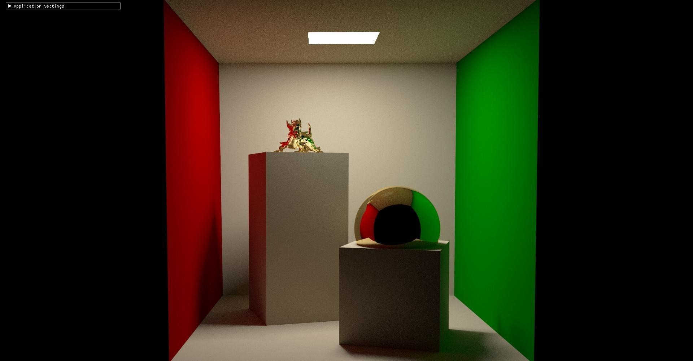

Path tracing rendering engine (Monte Carlo integration) written with the [Owl](https://github.com/owl-project/owl) library, a wrapper around [OptiX](https://developer.nvidia.com/rtx/ray-tracing/optix) 7 which NVIDIA's general (not reserved to rendering) ray tracing framework that can make use of the ray tracing hardware accelerators of NVIDIA GeForce RTX™ GPUs.

Implemented features:
- Direct lighting
- Indirect lighting
- Cook Torrance BRDF
- Diffuse textures
- Smooth normals
- ImGui Integration
- Integration of NVIDIA's OptiX™ AI-Accelerated Denoiser

